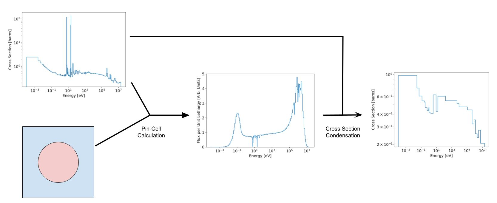
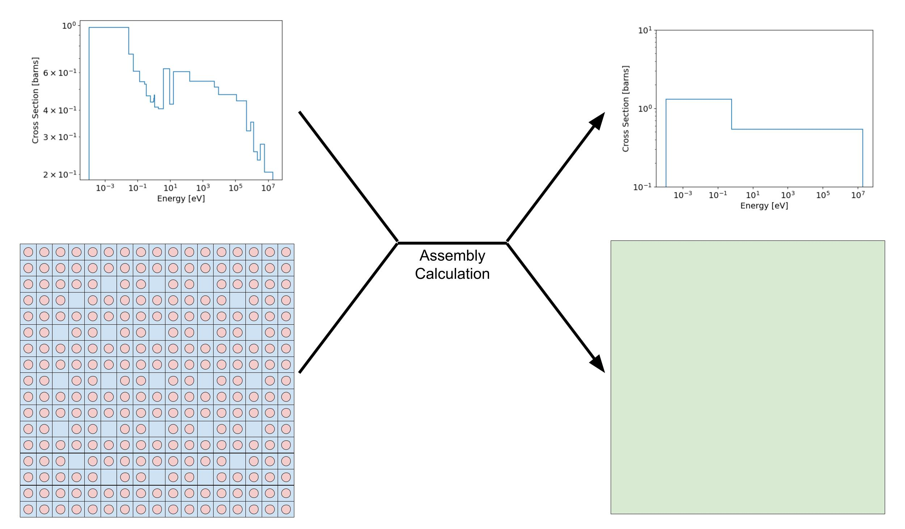

.. _lattice_calcs:

Lattice Physics Calculations
============================

Modeling the core of a nuclear reactor in its entirety, performing a transport
simulation considering all fuel pins in a fuel assemblies is a very expensive
task, computationally speaking. In the recent past, such detailed simulations
were practically impossible in 3D with many energy groups. Even today such a
calculation is tedious, and far to slow for rapid design work. Because of this,
lattice physics codes have traditionally been used in the field of nuclear
reactor core design to perform 2D simulations of single fuel assemblies. The
results of these simulations are then used to produce few-group (typically 2)
diffusion coefficients and cross sections. A nodal diffusion code then uses the
few-group data to performing a 3D diffusion simulation at the level of the
entire core. This "two-step" approach has long been used for nuclear reactor
design, and has been shown to be quite accurate, while also being
computationally efficient; today, it is possible to run a full-core simulation
on a moderate laptop using this approach.

.. _pin_calc:

    Depiction of the pin-cell spectrum calculation. This calculation typically
    ignores the surroundings of a fuel pin, and assumes an infinite lattice of
    the same pin.

The basic premise of the lattice physics calculation scheme is to start with
high resolution in energy and a small spatial domain, and move to low energy
resolution on a larger simulation domain. An example of this is provided in
:numref:`pin_calc`, where the fine cross section for the fuel is used to compute
a flux spectrum, and then condense the fine cross section from 281 to 25 energy
groups. A modern lattice code typically uses a nuclear data library with several
hundred energy groups. This fine group structure is used to perform a simulation
of a single pin-cell. The pin-cell calculation, sometimes referred to as the
spectrum calculation, is used to generate a flux spectrum, :math:`\varphi(E)`,
that is used to condense cross sections from the fine-group structure of the
library to a macro-group structure that typically has 20-40 energy groups.

.. _asmbly_calc_fig:

    Depiction of the assembly calculation. It considers the true geometry of
    the assembly, and is performed with either reflective or periodic boundary
    conditions.

Once the cross sections for all materials have been condensed to the
macro-group structure, they are used to perform a simulation of the entire fuel
assembly. This calculation is generally performed using the Method of
Characteristics so that the true assembly geometry can be represented as
accurately as possible. The subsequent results are then used to homogenize the
entire assembly into 2 group diffusion cross sections, as shown in
:numref:`asmbly_calc_fig`.

The subsequent sections outline in detail the methods used by Scarabée to
perform this sequence of calculations for generating few-group data for a
single assembly. It also covers the methodology used in full-core nodal
diffusion problems.
