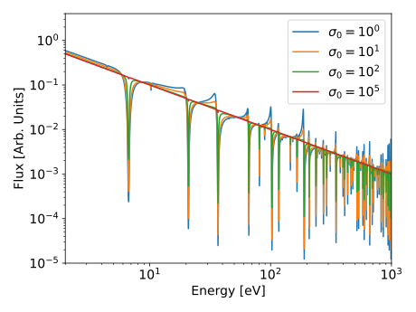
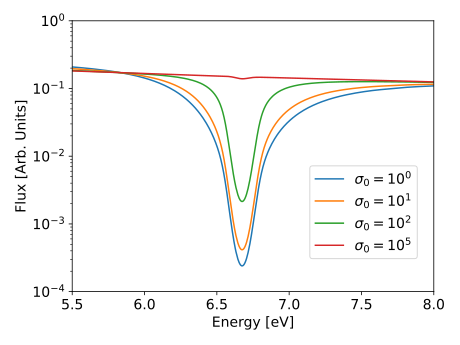
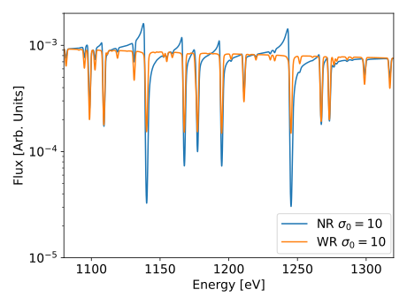

.. _self_shielding:

Self-Shielding
==============

One of the problems of solving the multi-group neutron transport equation is
that it necessitates adequate multi-group cross sections. The multi-group cross
section for reaction :math:`\alpha` in group :math:`g` can be defined as

.. math::
    :label: mgxs

    \Sigma_{a,g} = \frac{\displaystyle\int_{E_{g-1}}^{E_g} \Sigma_{a}(E)\varphi(E) \dd E}
                        {\displaystyle\int_{E_{g-1}}^{E_g} \varphi(E) \dd E}

The problem with Eq. :eq:`mgxs` is that it requires knowledge of the flux
spectrum, :math:`\varphi(E)`. However, if :math:`\varphi(E)` were already
known, we would not need it to generate multi-group cross sections to solve the
neutron transport equation. Therefore, the problem of self-shielding is
determining an approximate stand-in for the flux spectrum :math:`\varphi(E)`
that can be used as a weighting function to generate reasonably accurate
multi-group cross sections for a particular material and geometry.

Several methods have been developed to accomplish this task. These include
equivalence theory, the subgroup method, and ultra-fine group techniques. Here,
we will only consider the more traditional equivalence theory, as this method
is used in many industry lattice physics codes, and it is also the technique
used in Scarabée.

Neutron Slowing Down in Infinite Homogeneous Media
--------------------------------------------------

Let's assume that we have a homogeneous mixture of moderating isotopes along
with a single resonant isotope, :math:`r`. We need to find an approximation for
:math:`\varphi(E)` to be able to calculate the multi-group cross sections for
the system. The primary difficulty is encountered in the resonance region, where
there are many resonance and therefore dips in the flux spectrum. If we cannot
accurately predict the position and magnitude of these dips, we will not be able
to generate accurate grouped cross sections. We can start with the standard
neutron transport equation:

.. math::
    :label: transport_keff

    \dir\cdot\grad{\varphi(\pos,E,\dir)} + \Et(\pos,E)\varphi(\pos,E,\dir) =
	\\
	\int_0^\infty \int_{4\pi} \nu_s(\pos,E)\Es(\pos,E'\to E,\dir'\to\dir)\varphi(\pos,E',\dir')\dd\dir'\dd E' +
	\\
	\frac{1}{k}\int_0^\infty \int_{4\pi} \nu_p(\pos,E)\Ef(\pos,E'\to E,\dir'\to\dir)\varphi(\pos,E',\dir')\dd\dir'\dd E' +
	\\
	\frac{1}{k}
	\sum_{i}\frac{\chi_i(\pos, E)}{4\pi} \int_0^\infty \beta_i(\pos, E) \nu(\pos,E)\Ef(\pos,E') \int_{4\pi}\varphi(\pos,E',\dir')\dd\dir'\dd E'.

Our system is infinite, so we need not worry about the effects of leakage.
Similarly, our system is homogeneous so we can disregard the position arguments.
Finally, we are mostly concerned with the energy spectrum in the resonance
range. These energies are far too low for the birth of a fission neutron, so we
can neglect the fission source term. Similarly, the main mechanism for neutrons
to slow down in this energy region is through elastic scattering. Elastic
scattering always has a neutron yield of 1, and we will assume that it is
isotropic in our case. Actually, since the material is infinite and homogeneous,
we can neglect the direction parameter all together ! With all of these
simplifications, we arrive at the following simplified transport equation:

.. math::
    :label: simple_transport

    \Et(E)\varphi(E) = \int_0^\infty \Es(E'\to E)\varphi(E')\dd E'.

To proceed any further, one must know the functional form of
:math:`\Es(E'\to E)`. We are assuming that there is only elastic scattering.
We will also use the assumption that all target nuclei are at rest. This is a
good approximation at the higher energies of the resolved resonance region
(though it can be dubious at lower energies, near 1-20 eV in particular). If our
target nuclei are at rest, then we can use the asymptotic scattering kernel for
nuclei :math:`i`, which has the following form:

.. math::

    \sigma_{s,i}(E'\to E) = 
	\begin{cases}
		\frac{\sigma_{s,i}(E')}{(1-\alpha_i)E'} \quad \forall E\in[E',\alpha_i E'] \\\\
		0 \quad \forall E\notin[E',\alpha_i E']
	\end{cases} \qquad,

where :math:`\alpha_i = \left(\frac{A_i-1}{A_i+1}\right)^2` and :math:`A_i` is
the atomic weight ratio of the nucleus of isotope :math:`i` to a neutron. Using
this information, we can rewrite Eq. :eq:`simple_transport`, breaking up the
contributions from the resonant isotope, :math:`r`, and all other isotopes:

.. math::

    \left(N_r\sigma_{t,r}(E) + \sum_{m\ne r}N_m\sigma_{t,m}(E)\right)\varphi(E) =
	\frac{1}{1-\alpha_r}\int^{E/\alpha_r}_{E} N_r \sigma_{s,r}(E')\varphi(E')\frac{\dd E'}{E'} +
    \\
	\sum_{m\ne r}\frac{1}{1-\alpha_m}\int^{E/\alpha_m}_{E} N_m \sigma_{s,m}(E')\varphi(E')\frac{\dd E'}{E'}.

The next approximation we shall make is that that the total cross section for
all the non-resonant isotopes :math:`m\ne r` is constant and equal to the
potential scattering cross section (no absorption). For moderating materials,
this is a valid approximation. Even if there are other resonant absorbers in our
material, this is still not necessarily a bad approximation, as between
resonances, the total cross section will be very nearly the potential cross
section. In this case, we may substitute
:math:`\sigma_{t,m}(E)\approx\sigma_{p,m}`, resulting in a new slowing-down
equation:

.. math::

    \left(N_r\sigma_{t,r}(E) + \sum_{m\ne r}N_m\sigma_{p,m}\right)\varphi(E) =
	\frac{1}{1-\alpha_r}\int^{E/\alpha_r}_{E} N_r \sigma_{s,r}(E')\varphi(E')\frac{\dd E'}{E'} +
    \\
	\sum_{m\ne r}\frac{1}{1-\alpha_m}\int^{E/\alpha_m}_{E} N_m \sigma_{p,m}\varphi(E')\frac{\dd E'}{E'}.

This equation certainly represents an approximation if there are multiple
resonant nuclides in a material. For now, we will simply hope that the
resonances of other resonant nucleides in :math:`m\ne r` do not overlap with
the resonances of :math:`r`. If this is the case, our approximation is not too
bad. Unfortunately, however, resonance overlap with different nuclides does
occur, particularly when considering fuel depletion simulations. There are only
approximate means of handling this problem, which will not be covered here, as
Scarabée does not employ any treatment for resonance overlap. For the moderator
isotopes, we will assume that that the average energy lost by a neutron which
undergoes an elastic scatter is much larger than the width of a resonance in
isotope :math:`r`. When this is the case, for most of the integration range when
far from a resonance, we should expect the flux to approach the asymptotic flux
without absorption (:math:`1/E`) [Duderstadt]_ :

.. math::

    \varphi(E)\propto \frac{1}{E}.

Using this approximation in *only the integral for the moderator isotopes*,
one obtains:

.. math::

    \frac{N_m \sigma_{p,m}}{1-\alpha_m}\int^{E/\alpha_m}_{E}
    \frac{1}{E'^2}\dd E' =
    \frac{N_m \sigma_{p,m}}{1-\alpha_m} \frac{1-\alpha_m}{E} =
    \frac{N_m\sigma_{p,m}}{E}.

Substituting into the slowing-down equation, we have

.. math::

    \left(N_r\sigma_{t,r}(E) + \sum_{m\ne r}N_m\sigma_{p,m}\right)\varphi(E) =
	\frac{1}{1-\alpha_r}\int^{E/\alpha_r}_{E} N_r \sigma_{s,r}(E')\varphi(E')
    \frac{\dd E'}{E'} + \frac{\displaystyle\sum_{m\ne r}N_m\sigma_{p,m}}{E}.

All that remains is now the treatment of the slowing down due to the resonance
absorber, which can be handled with the narrow resonance approximation.

------------------------------
Narrow Resonance Approximation
------------------------------

In this approximation, we will assume that scattering with the resonant isotope
is dominated by potential scattering, and that the average energy lost in an
elastic collision with :math:`r` is large compared to the width of the
resonances in :math:`r`. In this case, a resonance appears to be narrow with
respect to the average energy loss of a neutron. With this, we can make similar
approximations to the moderator, and treat scattering with the absorber material
in the following manner:

.. math::

    \frac{1}{1-\alpha_r}\int^{E/\alpha_r}_{E} N_r \sigma_{s,r}(E')\varphi(E')
    \frac{\dd E'}{E'} \approx
    \frac{N_r\sigma_{p,r}}{1-\alpha_r}\int^{E/\alpha_r}_{E}
    \frac{\dd E'}{E'^2} = \frac{N_r\sigma_{p,r}}{E}.

With the substitution of this approximation, it is possible to algebraically
solve for :math:`\varphi(E)`, obtaining

.. math::

    \varphi_{_{NR}}(E) = \frac{N_r\sigma_{p,r} +
    \displaystyle\sum_{m\ne r}N_m\sigma_{p,m}}{E\left(\sigma_{t,r}(E) +
    \displaystyle\sum_{m\ne r}N_m\sigma_{p,m}\right)}.

Dividing the numerator and denominator by :math:`N_r`, and making the
substitution

.. math::
    :label: dilut

    \sigma_0 = \frac{\displaystyle\sum_{m\ne r}N_m\sigma_{p,m}}{N_r},

we can re-write our flux spectrum as

.. math::
    :label: nr

    \varphi_{_{NR}}(E) = \frac{\sigma_{p,r} +
    \sigma_0}{E\left(\sigma_{t,r}(E) + \sigma_0\right)},

where :math:`\sigma_0` is generally referred to as the *dilution*, and it
represents the effects on the flux spectrum due to all other isotopes in the
material.

.. _nr_fig:

    Narrow resonance flux for :math:`^{238}U` at varying dilutions.

.. _nr_zoom_fig:

    Narrow resonance flux for the 6.7 eV resonance of :math:`^{238}U` at
    varying dilutions.

:numref:`nr_fig` and :numref:`nr_zoom_fig` depict the narrow resonance
approximation for :math:`^{238}U` at different dilutions. One thing that becomes
immediately noticeable is that as the dilution increases, the depression in the
flux at the energy of the resonance decreases, and in the limit as
:math:`\sigma_0\to\infty`, :math:`\varphi(E) \to 1/E`, which is the asymptotic
flux without absorption. This of course, makes sense, as if we had a single
:math:`^{238}U` atom in a sea of :math:`^{1}H`, we would not expect any
depression in the flux, and as more :math:`^{238}U` is added (i.e. the dilution
goes down), the depression would become larger and larger.

----------------------------
Wide Resonance Approximation
----------------------------

An alternative to the narrow resonance approximation is the wide resonance
approximation. In this case, the average energy loss of a neutron which
undergoes elastic scattering with isotope :math:`r` is comparable to, or
smaller than the width of a resonance. In this case, we will instead assume
that :math:`r` is infinitely large, implying that
:math:`\alpha_r \rightarrow 1`. If this were the case, a neutron would not lose
any energy in an elastic collision, and all resonances would be *wide*. Under
this approximation, we find that

.. math::

    \lim_{\alpha_r \rightarrow 1}\frac{1}{1-\alpha_r}\int^{E/\alpha_r}_{E} N_r \sigma_{s,r}(E')\varphi(E') \frac{\dd E'}{E'} \approx
    \\\\
    \lim_{\alpha_r \rightarrow 1} \frac{N_r \sigma_{s,r}(E)\varphi(E)}{1 - \alpha_r} \int^{E/\alpha_r}_{E} \frac{\dd E'}{E'} =
    \\\\
    N_r \sigma_{s,r}(E)\varphi(E) \lim_{\alpha_r \rightarrow 1} \frac{\ln(1/\alpha_r)}{1 - \alpha_r} =
    \\\\
    N_r \sigma_{s,r}(E)\varphi(E).

Using this approximation, we find that the wide resonance flux spectrum is

.. math::
    :label: wr

    \varphi_{_{WR}}(E) = \frac{\sigma_0}{E\left(\sigma_{a,r}(E) + \sigma_0\right)}.

.. _wr_nr_fig:

    Comparison of the narrow resonance and wide resonance flux for :math:`^{238}U` at a dilution of 10 barns.

:numref:`wr_nr_fig` provides a comparison of the narrow resonance and wide
resonance approximations. In absorption dominated resonances, they are very
similar. However, in scattering dominated resonances, such as the one located
at 1140 eV, the differences can be quite significant. 

------------------------------------
Intermediate Resonance Approximation
------------------------------------

Whether the narrow resonance or wide resonance approximation should be applied
depends on the width of each individual resonance, the mass of resonant nuclide
:math:`r`, and the mass of the background moderator nuclides. In general, the
true flux spectrum is likely (but not necessarily) something in between the
narrow and wide resonance limits. This led to [Goldstein]_ and Cohen proposing
the intermediate resonance approximation, which can be written as

.. math::
    :label: ir
    
    \varphi_{_{IR}}(E) = \frac{\lambda_r\sigma_{p,r} + \sigma_0}{E\left(\sigma_{a,r}(E) + \lambda_r\sigma_{s,r}(E) + \sigma_0\right)},

where :math:`\lambda_r` is the intermediate resonance (IR) parameter for nuclide
:math:`r`, sometimes referred to as the Goldstein-Cohen parameter. From this
formula, one can easily see that when :math:`\lambda_r = 0`, the wide resonance
approximation is retrieved; conversely, when :math:`\lambda_r = 1`, one obtains
the narrow resonance approximation. For this reason, some argue it is required
that :math:`\lambda_r \in [0, 1]`, though others such as [Sanchez]_ have
pointed out that this is not a necessary restriction of the model.

Many lattice physics codes use the approximation that each nuclide :math:`r`
has a single IR parameter :math:`\lambda_r`, which is used at all energies
where cross section self-shielding is required. This is not an ideal
approximation. At higher energies, resonances generally appear to be narrower
when compared to the average energy loss of a neutron. At lower energies in
resolved resonance region, the wide resonance approximation can start to
become more valid. This implies that each individual resonance should have a
unique IR parameter. While this would be the most accurate approach, it would
require performing the resonance integral calculation for each individual
resonance, which is impractical; if such a level of detail and fidelity is
required, Monte Carlo methods are likely a better solution strategy than
deterministic methods. As a compromise, some codes chose to have a unique IR
parameter for each nuclide in each energy group, therefore replacing
:math:`\lambda_r` with :math:`\lambda_{r,g}`. This is the approximation that
is used in Scarabée.

To generate group-wise IR parameters for each nuclide in the nuclear data
library, Scarabée employs the hydrogen equivalence method similar to that used
for the DeCART code [Xu]_. Scarabée has a built-in neutron slowing-down flux
spectrum solver, that can solve the slowing down equation for a single resonant
isotope with any number of purely scattering background moderator isotopes that
can have a user specified mass and a constant cross section.

Additionally, when using the IR approximation, we should account for the fact
that the background nuclides not not contribute to slowing down as much as
hydrogen. This fact is captured by the IR parameter. In this framework, we
instead calculate the background dilution as

.. math::
    :label: ir_dilut

    \sigma_{0,g} = \frac{\displaystyle\sum_{m\ne r}N_m \lambda_{r,g} \sigma_{p,m}}{N_r}.

When using the IR approximation, this equation should replace that given by Eq
:eq:`dilut`. This slightly complicates the self-shielding process, however, as
the dilution is now energy dependent.

Heterogeneous Media
--------------------

In a nuclear reactor, we do not (usually) have a homogeneous fuel-moderator
gloop for which the previous approximations can be used. Instead, the fuel is
put into lumps, or fuel rods, which is surrounded by moderator. We must estimate
the flux spectrum in the fuel for such a heterogeneous case, in order to obtain
multi-group cross sections. We do not care about the moderator so much, as it
does not have resonances, and therefore does not need to be self-shielded. We
will write our multi-region equation for a single fuel rod in moderator as

.. math::

    \Sigma_{t,f}(E)\varphi_f(E)V_f = P_{f\to f}(E) V_f \int_0^\infty \Sigma_{s,f}(E'\to E)\varphi_f(E')\dd E' + \\
	P_{m\to f}(E) V_m \int_0^\infty \Sigma_{s,m}(E'\to E)\varphi_m(E')\dd E'

where :math:`P_{f\to f}` is the probability of flying from the fuel to the fuel
and having a collision, while :math:`P_{m\to f}` is the probability of flying
from the moderator to the fuel and having a collision. If we apply the narrow
resonance approximation, the result is

.. math::
    :label: fuel_flux_no_cp_reciprocity

    \Sigma_{t,f}(E)\varphi_f(E)V_f = \frac{1}{E}\left(\left(1-P_{f\to m}(E)\right)V_f\Sigma_{p,f} + P_{m\to f}(E)V_m\Sigma_{p,m}\right).

This formalism, of looking at the probability of flying from one region to
another and having a collision is called the method of *collision
probabilities*. In collision probabilities, there is a reciprocity relation of
the form

.. math::

    P_{m\to f}(E)V_m\Sigma_{p,m} = P_{f\to m}(E)V_f\Sigma_{t,f}(E).

The reciprocity relation is based on the idea that a neutron has the same
probability to fly along a ray and then have a collision, whether it is flying
in the forward or backwards direction along the ray. Using this relation, we can
rewrite Eq. :eq:`fuel_flux_no_cp_reciprocity` as

.. math::
    :label: fuel_flux_cp

    \varphi_f(E) = \frac{1}{E}\left[\left(1-P_{f\to m}(E)\right)\frac{\Sigma_{p,f}}{\Sigma_{t,f}(E)} + P_{f\to m}(E)\right].

Therefore, if we are able to determine :math:`P_{f\to m}(E)`, we could derive
an approximation for the flux spectrum in the fuel. This is the probability of
a particle flying from the fuel to the moderator and having a collision. It is
also often called the escape probability, as it is the probability of neutron to
escape the fuel. For this reason, we introduce the alternative notation

.. math::

    P_e(E) \equiv P_{f\to m}(E),

which will be used from here on out.

-----------------------------
Wigner Rational Approximation
-----------------------------

Without giving many details here, we shall simply postulate that we will employ
the Wigner rational approximation for the escape probability which has the form:

.. math::

    P_e(E) = \frac{1}{\Sigma_{t,f}(E)\bar{l} + 1},

:math:`\bar{l}` being the average chord length of the fuel lump, defined as

.. math::

    \bar{l} = \frac{4V}{S}

where :math:`V` is the volume of the resonant material lump and :math:`S` is its
surface area.

Substitution of the Wigner rational approximation into Eq. :eq:`fuel_flux_cp`
yields

.. math::

	\varphi_f(E) = \frac{1}{E}\frac{\Sigma_{p,f} + 1/\bar{l}}
                                   {\Sigma_{t,f}(E) + 1/\bar{l}} =
    \frac{1}{E}\frac{\Sigma_{p,f} + \Sigma_e}{\Sigma_{t,f}(E) + \Sigma_e},

with :math:`\Sigma_e=1/\bar{l}` being the *escape cross section*. Again, we will
consider a single resonant nuclide, :math:`r`, and we can then rewrite the flux
spectrum in an isolated fuel lump as

.. math::
    :label: homo_heto_equiv

	\varphi(E) = \frac{1}{E}
    \frac{\sigma_{p,r} + \left(\sigma_{0,f} + \Sigma_e/N_r\right)}
         {\sigma_{t,r}(E) + \left(\sigma_{0,f} + \Sigma_e/N_r\right)}.

Equation :eq:`homo_heto_equiv` is particularly powerful, as it has an identical
form to Eq. :eq:`nr`. This tells us that we can approximate the flux spectrum in
a heterogeneous system as the flux in a homogeneous system with a modified
effective dilution of the form

.. math::
    :label: wigner_dilution

	\sigma_{0,\text{eff}} = \sigma_{0,f} + \frac{\Sigma_e}{N_r},

with :math:`\sigma_{0,f}` being the standard dilution cross section of the fuel
according to Eq :eq:`dilut` in the narrow resonance approximation, or according
to Eq :eq:`ir_dilut` in the intermediate resonance approximation. Therefore, we
have found an equivalence between an infinite homogeneous system and a
heterogeneous system. It is for this reason that this method of treating
self-shielding is referred to as *equivalence theory*.

---------------------------------
Multi-Term Rational Approximation
---------------------------------

This concept can be expanded upon, and better results can be achieved, by
extending the approximation for the escape probability as

.. math::

	P_e(E) = \sum_n b_n \frac{a_n \Sigma_e}{\Sigma_{t,f}(E) + a_n\Sigma_e},

constrained to

.. math::

	\sum_n b_n = 1.

Adding multiple terms can provide a better approximation of the true escape
probability. Substitution into Eq. :eq:`fuel_flux_cp` yields

.. math::

	\varphi_f(E) = \frac{1}{E}\sum_n b_n \frac{\sigma_{p,r} + \sigma_{0,n}}{\sigma_{t,r}(E) + \sigma_{0,n}},

where the effective dilution for the :math:`n\text{th}` term is

.. math::

	\sigma_{0,n} = \sigma_{0,f} + \frac{a_n\Sigma_e}{N_r}.

Use of the multi-term rational approximation is admittedly a bit more
cumbersome. Instead of considering all of the cross sections for a nuclide at a
single dilution, multiple dilutions must now be considered. If you want to know
the multi-group cross section :math:`\sigma_{x,r,g}`, that is for resonant
nuclide :math:`r`, reaction :math:`x`, in group :math:`g`, then

.. math::

	\sigma_{x,r,g} = \frac{\displaystyle\sum_n b_n \varphi_{n,g} \sigma_{x,r,g,n}}
                          {\displaystyle\sum_n b_n \varphi_{n,g}}

with

.. math::

	\varphi_{n,g} = \frac{\lambda_{r,g}\sigma_{p,r} + \sigma_{0,n}}{\sigma_{a,r,g,n} + \lambda_{r,g}\sigma_{s,r,g,g} + \sigma_{0,n}}

in the intermediate resonance approximation. In this notation,
:math:`\sigma_{x,r,g,n}` is the multi-group cross section for reaction
:math:`x` with nuclide :math:`r` in group :math:`g`, using the effective
dilution :math:`\sigma_{0,n}`. It is worth reiterating here that
:math:`\sigma_{0,n}` is also dependent on the energy group in the intermediate
resonance approximation, according to Eq :eq:`wigner_dilution` and Eq
:eq:`ir_dilut`.

-----------------------------------------------------
Carvik's and Roman's Two-Term Rational Approximations
-----------------------------------------------------

Historically, it has been very common to use a two-term rational approximation.
For cylindrical resonant lumps, the most common form for the escape probability
is Carlvik's approximation which takes the form:

.. math::

	P_e(E) = 2\frac{2\Sigma_e}{\Sigma_{t,f}(E) + 2\Sigma_e} -
              \frac{3\Sigma_e}{\Sigma_{t,f}(E) + 3\Sigma_e}.

For an infinitely long cylinder, the escape cross section can be written as

.. math::

    \Sigma_e = \frac{1}{\bar{l}} = \frac{S}{4V} = \frac{1}{2R},

where :math:`R` is the radius of the cylinder.

Similarly, for an infinite slab resonant lump, Roman's approximation of the
escape probability is written as

.. math::

	P_e(E) = 1.1\frac{1.4\Sigma_e}{\Sigma_{t,f}(E) + 1.4\Sigma_e} -
             0.1\frac{5.4\Sigma_e}{\Sigma_{t,f}(E) + 5.4\Sigma_e},

with

.. math::

    \Sigma_e = \frac{1}{2W},

where :math:`W` is the width of the slab.

Dancoff Factors
---------------

The previous presentations of the fuel escape probability do not consider the
possibility of a neutron leaving the fuel lump and flying into another fuel
lump. In traditional LWRs, the fuel rods and tightly packed into fuel
assemblies, which themselves are tightly packed into the core. Because of this
fuel loading, it is very likely that a particle could fly from one fuel pin to
another and undergo a collision. This lattice effect will effectively reduce
the escape probability, :math:`P_e(E)`, for a particle to leave the fuel. If
this lattice or shadowing effect is not accounted for in the escape probability,
the computed cross sections for our resonant materials will be incorrect, and
our deterministic simulations will have poor agreement with reference Monte
Carlo results.

To account for these effects, a *Dancoff Factor* or *Dancoff Correction* is
used to modify :math:`P_e(E)`. The Dancoff correction is typically denoted as 

.. math::

	C = \frac{I_0 - I}{I}

where :math:`I_0` is the number of neutrons entering the fuel region in an
isolated system, and :math:`I` is the number of neutrons entering the fuel in a
lattice system. As such, when :math:`C = 0`, there is no correction to be made,
and the isolated an lattice systems are equivalent (could only happen if the
pins are extraordinarily far apart). However, if :math:`C=1`, the moderator
region is fully shadowed by other fuel elements, and it is as if neutrons cannot
fly into the moderator. Sometimes, we also use the Dancoff factor, defined as

.. math::

    D = 1 - C.

--------------------------------------------
Modifications to the Fuel Escape Probability
--------------------------------------------

In the Wigner rational approximation, the Dancoff factor modifies the dilution
cross section of Eq. :eq:`wigner_dilution` in the following manner:

.. math::

	\sigma_0 = \sigma_{0,f} + \frac{D\Sigma_e}{N_r}.

Since :math:`D\in(0,1)`, this can be interpreted as reducing the escape cross
section of the fuel, which also is equivalent to reducing its surface area. This
makes sense, as it reflects the reduction in the probability of a neutron flying
into the moderator and undergoing a collision.

When used with the multi-term rational approximation, the modifications are not
so simple, as all the :math:`a_n` and :math:`b_n` terms must be modified. For
two-term rational approximations, there is thankfully a known transformation
that permits us to calculate :math:`\alpha_n` and :math:`\beta_n` which can be
used to replace :math:`a_n` and :math:`b_n`. This transformation is taken from
Gibson's PhD thesis [Gibson]_ :

.. math::

    A = \frac{1 - C}{C}

.. math::

    \gamma = A + b_1a_1 + b_2a_2

.. math::

    \alpha_1 = \frac{A(a_1 + a_2) + a_1a_2 - \sqrt{(A(a_1 + a_2) + a_1a_2)^2 - 4\gamma Aa_1a_2}}{2\gamma}

.. math::

    \alpha_2 = \frac{A(a_1 + a_2) + a_1a_2 + \sqrt{(A(a_1 + a_2) + a_1a_2)^2 - 4\gamma Aa_1a_2}}{2\gamma}

.. math::

    \beta_1 = \left(\alpha_2 - \frac{A(b_1a_1 + b_2a_2)}{\gamma}\right)\frac{1}{\alpha_2 - \alpha_1}

.. math::

    \beta_2 = 1 - \beta_1

---------------------------
Calculating Dancoff Factors
---------------------------

Since the Dancoff factor represents the shadowing effect of other fuel pins on
the escape probability, it is straight forward to see that it would depend on
the geometric properties of the system, such as the pin pitch, wether we are
considering a pin near a guide tube or water hole, and the material properties.
Due to these considerations, it is evident that each fuel pin should have its
own unique Dancoff factor.

To compute the Dancoff factor for each pin, Scarabée uses the *neutron current
method* [Knott]_. This procedure performs two one-group fixed source transport
calculations: one for a single isolated fuel pin with vacuum boundary
conditions, and a second for the true geometry of the assembly with the
appropriate boundary conditions. In each simulation, the total cross section of
each material (with the exception of the fuel) is set to the potential cross
section of the material. There is no scattering, only absorption. For the fuel,
the cross section is set to a very large value (:math:`\Et = \Ea = 10^5`). The
source in the fuel regions is zero while the source in the other regions is also
equal to the value of the potential cross section. From these two simulations,
the Dancoff correction for fuel pin :math:`i` can be calculated as

.. math::

    C_i = \frac{\varphi_0 - \varphi_i}{\varphi_0},

where :math:`\varphi_0` is the flux inside the isolated fuel pin and
:math:`\varphi_i` is the flux inside pin :math:`i` from the simulation of the
true geometry. Since the two required simulations are only single-group
fixed-source problems, they converge very quickly, and only take a few seconds
to complete.

Stoker-Weiss Method for Annular Rings
--------------------------------------

For standard fuel pins made of :math:`\text{UO}_2` or MOX fuel, the entire pin
is treated as a single resonant region. There is only one set of self-shielded
cross sections for the entire pin. Standard equivalence theory is not able to
consider the effects of *spatial* self-shielding. This effect can be important
for pins containing Gadolinium poison, where there is a very strong gradient in
the flux from the outer ring of the pin to the center. If this spatial
self-shielding caused by Gadolinium or Erbium in the fuel is not considered,
multi-group transport calculations will not have accurate predictions for the
reaction rates at different annuli in the fuel pin. This can lead to bad
estimates of :math:`\keff` and even worse predictions for the burn-up of the
fuel pin in annular rings, often referred to as the *onion ring* effect.

To account for this onion ring effect in the context of equivalence theory,
Stoker and Weiss developed a method of generating spatially self-shielded cross
sections for annular rings of a fuel pin [Stoker]_ . In their derivation, the escape
probability for the :math:`i\text{th}` ring of a fuel pin is written as

.. math::

    P_{e,i}(E) = \sum_{m=1}^{4} \eta_{i,m} \sum_{n=1}^{N} b_n \frac{a_n\Sigma_e}{\Et(E) + a_n\Sigma_e}

where :math:`\eta_{i,m}` is defined as

.. math::

    \eta_{i,m} =
    \begin{cases}
        \frac{\rho_il_{i,1}}{l_i}  & m = 1 \\
        -\frac{\rho_il_{i,2}}{l_i} & m = 2 \\
        -\frac{\rho_{i-1}l_{i,3}}{l_i} & m = 3 \\
        \frac{\rho_{i-1}l_{i,4}}{l_i}  & m = 4
    \end{cases}
    \quad.

Here, :math:`l_i=4V_i/S_f` is the mean chord length of the :math:`i\text{th}`
ring, where :math:`V_i` is the volume of the ring and :math:`S_f` is the
surface area of the entire fuel pellet. :math:`\rho_i` is ratio of the outer
radius of the ring to the radius of the pellet, while :math:`\rho_{i-1}` is
the ratio of the inner radius of the ring to the radius of the pellet. The
:math:`l_{i,m}` term is defined as

.. math::

    l_{i,m} = \frac{2R}{\pi}\left(\sqrt{1 - \rho^2} + \frac{\sin^{-1}\rho}{\rho} + \theta\right)
    \quad
    \begin{cases}
        \rho = \rho_i,     & \theta = \frac{\pi\rho_i}{2}      , & m = 1 \\
        \rho = \rho_i,     & \theta = -\frac{\pi\rho_i}{2}     , & m = 2 \\
        \rho = \rho_{i-1}, & \theta = \frac{\pi\rho_{i-1}}{2}  , & m = 3 \\
        \rho = \rho_{i-1}, & \theta = -\frac{\pi\rho_{i-1}}{2} , & m = 4
    \end{cases}
    \quad,

:math:`R` being the radius of the fuel pellet. Using this definition for the
escape probability, the 

multi-group cross section for resonant nuclide :math:`r`, reaction :math:`x`,
in group :math:`g`, for ring :math:`i` of a fuel pin can be calculated as

.. math::
    \sigma_{x,r,g,i} =
    \frac{\displaystyle\sum_{m=1}^4 \eta_{i,m}\sum_{n=1}^N b_n \sigma_{x,r,g,nm}\varphi_{r,g,nm}}
         {\displaystyle\sum_{m=1}^4 \eta_{i,m}\sum_{n=1}^N b_n\varphi_{r,g,nm}}

In this notation, :math:`\sigma_{x,r,g,nm}` is the multi-group cross section for
reaction :math:`x` with nuclide :math:`r` in group :math:`g`, using the
effective dilution :math:`\sigma_{0,nm}`.

.. math::

    \sigma_{0,nm} = \sigma_{0,f} + \frac{a_n}{N_r l_{i,m}}.

The flux :math:`\varphi_{r,g,nm}` is defined as

.. math::

    \varphi_{r,g,nm} = \frac{\lambda_{r,g}\sigma_{p,r} + \sigma_{0,nm}}{\sigma_{a,r,g,nm} + \lambda_{r,g}\sigma_{s,r,g,nm} + \sigma_{0,nm}}.

Cladding Self-Shielding
-----------------------

Most literature on self-shielding methods exclusively considers the
self-shielding calculation of the fuel. This is understandable, as it is the
most important effect in any LWR calculation. However, any modern lattice
physics code must also have a resonance self-shielding treatment for the
cladding of fuel pins. The Zirconium isotopes have many resonances, and
neglecting their self-shielding can have a non-negligible effect. Scarabée uses
the approach taken by the STREAM lattice physics code for the self-shielding of
fuel pin cladding and guide tubes [Choi]_ . These regions are shielded at the same
time, using Roman's two-term approximation for the escape probability, as if
they were infinite slabs. Dancoff factors for each cladding and guide are also
computed using the neutron current method, except the cladding regions are
treated as the resonance regions instead of the fuel.

.. [Duderstadt] \ J. J. Duderstadt and L. J. Hamilton, *Nuclear Reactor Analysis*. John Wiley & Sons, 1976.

.. [Knott] \ D. Knott and A. Yamamoto, *Lattice Physics Computations* In *Handbook of Nuclear Engineering*, 2010.

.. [Gibson] \ N. Gibson, *Novel Resonance Self-Shielding Methods for Nuclear Reactor Analysis*, Massachusetts Institute of Technology, 2016.

.. [Stoker] \ C. C. Stoker and Z. J. Weiss, *Spatially dependent resonance cross sections in a fuel rod*, Annals of Nuclear Energy, vol. 23, no. 9, pp. 765–778, 1996, doi: 10.1016/0306-4549(95)00074-7.

.. [Choi] \ S. Choi, H. Lee, S. G. Hong, and D. Lee, *Resonance self-shielding methodology of new neutron transport code STREAM*, Journal of Nuclear Science and Technology, vol. 52, no. 9, pp. 1133–1150, 2015, doi: 10.1080/00223131.2014.993738.

.. [Goldstein] \ R. Goldstein and E. R. Cohen, *Theory of Resonance Absorption of Neutrons*, Nuclear Science and Engineering, vol. 13, no. 2, pp. 132–140, 1962, doi: 10.13182/nse62-1.

.. [Sanchez] \ R. Sanchez, *On the Intermediary Resonance method and beyond*, Annals of Nuclear Energy, vol. 213, p. 111085, 2025, doi: 10.1016/j.anucene.2024.111085.

.. [Xu] \ Y. Xu, Z. Gao, and T. Downar, *The Calculation of Resonance Parameters for the DeCART MOC Code*, in M&C + SNA 2007, Monterey, California, 2007.